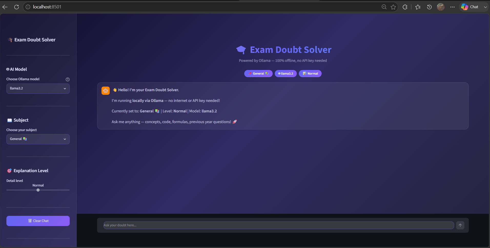

**_# 🎓 Exam Doubt Solver Chatbot_**

An AI-powered Exam Doubt Solver built using **Python, Streamlit, LangChain, and Ollama** that helps students solve academic doubts across multiple Computer Science subjects.

This project runs completely offline using locally hosted Large Language Models (LLMs) through Ollama, eliminating the need for API keys or paid subscriptions.

---

**_## 📸 Project Preview_**



**_## 🚀 Features_**

- 🤖 AI-powered doubt solving using Ollama
- 📚 Subject-wise tutoring support
- 🎯 Adjustable explanation levels
- 💬 Chat history support
- ⚡ Real-time streaming responses
- 🔐 Completely offline and API-free
- 🎨 Modern dark-themed user interface

---

**_## 📚 Supported Subjects_**

- Data Structures & Algorithms
- Operating Systems
- Database Management Systems (DBMS)
- Computer Networks
- Object-Oriented Programming (Java/C++)
- Theory of Computation
- Mathematics
- General Academic Queries

---

**_## 🛠️ Tech Stack_**

- Python
- Streamlit
- LangChain
- Ollama
- Llama 3.2

---

**_## 🏗️ Project Workflow**

```text
User Question
      │
      ▼
Streamlit UI
      │
      ▼
LangChain Prompt Builder
      │
      ▼
Subject-Specific Prompt
      │
      ▼
Ollama (Local LLM)
      │
      ▼
AI Response
      │
      ▼
Chat Interface
```

---

**_## 📂 Project Structure_**

```text
Exam_doubt_solver_chatbot/
│
├── app.py
├── requirements.txt
└── README.md
```

---

**_## ⚙️ Installation_**

### Clone Repository

```bash
git clone https://github.com/Nancy-sharma01/Exam_doubt_solver_chatbot.git
cd Exam_doubt_solver_chatbot
```

### Install Dependencies

```bash
pip install -r requirements.txt
```

### Install Ollama

Download Ollama from:

https://ollama.com

### Pull Llama 3.2 Model

```bash
ollama pull llama3.2
```

### Run the Application

```bash
streamlit run app.py
```

---

**_## 🎯 Use Cases_**

- Exam Preparation
- Concept Revision
- Programming Doubts
- Subject-Specific Learning
- Interview Preparation
- Academic Self-Study

---

**_## 🔮 Future Enhancements_**

- PDF Notes Upload
- Previous Year Question Analysis
- Voice-Based Interaction
- Quiz Generation
- Multi-Language Support

---

**_## 👩‍💻 Developer_**

_**Nancy Sharma**_

_B.Tech Computer Science Engineering Student_

Passionate about Artificial Intelligence, Data Analytics, and Software Development.

---

⭐ _If you found this project useful, consider giving it a star._
